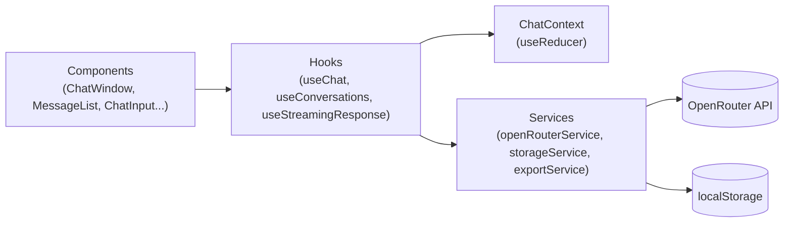
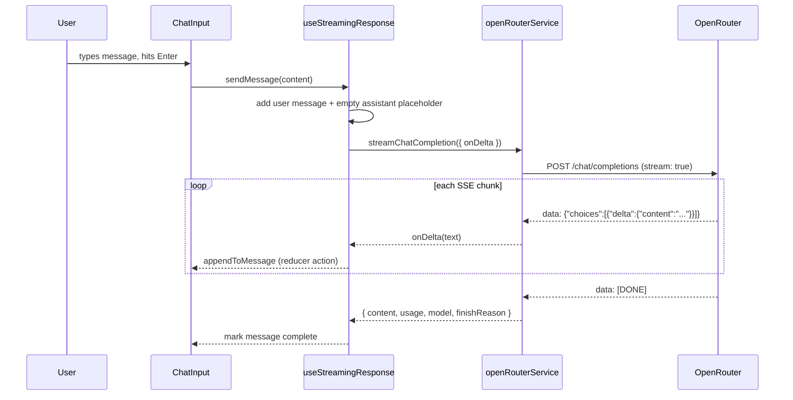
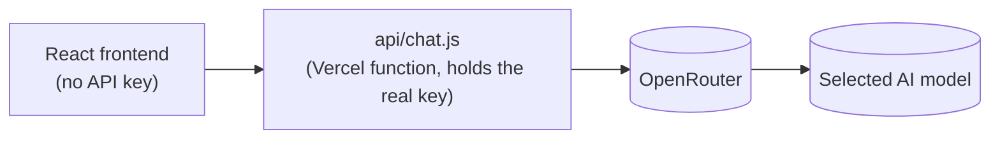

# Ai Chat Bot

A production-quality AI chat workspace built with React, Vite, and the [OpenRouter](https://openrouter.ai) API. This is not a ChatGPT clone tutorial — it's a demonstration of real frontend architecture: streaming responses, a reducer-driven state layer, a service abstraction over the API, local persistence with an IndexedDB-ready storage layer, and the kind of polish (keyboard shortcuts, command palette, accessible modals, responsive drawer navigation) expected of a shipped product.

## Live Demo

**[ai-chatbot-fz17.vercel.app](https://ai-chatbot-fz17.vercel.app)** — chat requests are proxied through a server-side Vercel function (`api/chat.js`), so the OpenRouter key stays private and is never exposed to the browser.

> **Running this yourself needs an OpenRouter API key.** The project intentionally does not ship with one — see [Environment Variables](#environment-variables) below. The key is read server-side only (`OPENROUTER_API_KEY`, no `VITE_` prefix) by a Vercel serverless function, so it is never bundled into client-side JavaScript or visible in devtools (see [Security Considerations](#security-considerations)).

---

## Table of Contents

- [Features](#features)
- [Tech Stack](#tech-stack)
- [Architecture](#architecture)
- [React Concepts Demonstrated](#react-concepts-demonstrated)
- [OpenRouter Integration](#openrouter-integration)
- [Streaming Architecture](#streaming-architecture)
- [State Management](#state-management)
- [Custom Hooks](#custom-hooks)
- [Local Development](#local-development)
- [Environment Variables](#environment-variables)
- [Security Considerations](#security-considerations)
- [API Key Architecture](#api-key-architecture)
- [Local Persistence & IndexedDB Migration Path](#local-persistence--indexeddb-migration-path)
- [Testing Checklist](#testing-checklist)
- [Future Improvements](#future-improvements)
- [Lessons Learned](#lessons-learned)

---

## Features

- Streaming AI responses (token-by-token rendering, not a spinner-then-dump)
- Multiple conversations: create, rename, delete, search (title + message content), clear all
- Stop generation mid-stream (`AbortController`), retry failed requests, regenerate responses
- Edit a past message — truncates everything after it and regenerates from that point
- Markdown rendering with syntax-highlighted code blocks and one-click copy (message-level and per-code-block)
- Model switching, per-conversation and as a global default, without losing conversation history
- System prompt: a global default plus a per-conversation override
- Light / Dark / System theme, driven entirely by CSS custom properties
- Command palette (`Ctrl/Cmd+K`) and keyboard shortcuts (new chat, stop generation, etc.)
- Export/import conversations as JSON, with structural validation on import
- Fully responsive: off-canvas drawer sidebar on tablet/mobile, no horizontal overflow anywhere
- Local persistence via `localStorage`, structured to migrate to IndexedDB later with no caller changes

## Tech Stack

- **React 19** + **Vite** — no Redux, no router (single-view app, Context + `useReducer` is sufficient)
- **react-markdown** + **remark-gfm** + **rehype-highlight** — safe Markdown rendering with syntax highlighting
- **oxlint** — fast linting
- Zero UI component library — a small hand-built design system (see `src/index.css`)

## Architecture

```
src/
├── components/
│   ├── layout/        # AppShell, Header, Sidebar — page structure
│   ├── chat/           # ChatWindow, MessageList, MessageBubble, ChatInput, CodeBlock, MarkdownRenderer...
│   ├── conversations/  # ConversationList, ConversationItem, ConversationSearch
│   ├── settings/       # SettingsPanel, ModelSelector, SystemPromptEditor
│   └── common/         # Modal, CommandPalette, CopyButton — cross-cutting UI
├── context/            # ChatContext + reducer, ThemeContext
├── hooks/               # useChat, useConversations, useStreamingResponse, useTheme, ...
├── services/            # openRouterService, storageService, exportService — no fetch/localStorage calls outside these
├── config/               # app.js, models.js, theme.js — single source of truth for constants
└── utils/                # markdown.js, formatting.js
```

Every fetch call to OpenRouter lives in exactly one file (`services/openRouterService.js`). Every `localStorage` read/write lives in exactly one file (`services/storageService.js`). No component ever touches either directly — this is what makes both swappable later (e.g. a backend proxy, or IndexedDB) without touching UI code.



## React Concepts Demonstrated

- **Context API + `useReducer`** for centralized, predictable chat state (`ChatContext` / `chatReducer`)
- **Custom hooks** as the only interface components use to touch state or services (`useChat`, `useConversations`, `useStreamingResponse`, `useTheme`, `useKeyboardShortcuts`, `useDebounce`, `useClipboard`)
- **`React.memo`** on `MessageBubble`, paired with stabilized callback identities (see [Lessons Learned](#lessons-learned)) so a long conversation doesn't re-render every message on every streamed token
- **Refs for "latest value" access** (`useRef` + assignment-during-render) to keep callback identities stable without stale closures — used in `useChat` and `useStreamingResponse`
- **Controlled forms** throughout (chat input, settings, rename fields) with no uncontrolled/DOM-read patterns
- **Portal-free accessible modals** with focus-on-open, Escape-to-close, and backdrop-click-to-close
- **Debouncing** (search input, localStorage persistence during streaming) to avoid wasted work
- **Composition over configuration** — e.g. `CodeBlock` and `pre` overrides passed into `react-markdown`'s `components` prop, rather than forking the renderer

## OpenRouter Integration

All requests go through `src/services/openRouterService.js`, which:

- Calls `/api/chat`, a Vercel serverless function that attaches the OpenRouter key server-side; a missing/misconfigured key surfaces as a normal, human-readable error — never a crash
- Builds an OpenAI-compatible `POST /chat/completions` request with `stream: true`
- Parses the raw SSE response manually (`ReadableStream` + `TextDecoder`), buffering across chunk boundaries since network chunks don't align to line boundaries
- Normalizes every failure mode (missing key, 401/403, 429, 404, 5xx, network failure, malformed JSON chunk, empty response, cancellation) into one typed `OpenRouterError` with a `type` field the UI can branch on, and a message that's always safe to show a user
- Supports cancellation via `AbortController`/`AbortSignal`

## Streaming Architecture



The assistant message is created **empty** and immediately visible (with a "thinking" indicator) the instant the user sends a message — content is appended token-by-token via a dedicated `APPEND_TO_MESSAGE` reducer action, not by reading-then-writing the message's current content in a closure (which would be prone to stale-state bugs under rapid successive dispatches).

## State Management

`ChatContext` + `chatReducer` hold everything: conversations, messages, the active conversation, generation status, errors, and global settings. `useChat` and `useConversations` are the two hooks that read/write this state — `useChat` for message-level operations on the *active* conversation, `useConversations` for list-level operations (create/rename/delete/select) used by the sidebar.

`useStreamingResponse` is the orchestration layer: it composes `useChat`'s primitives with `openRouterService` to implement send/stop/regenerate/retry/edit, but never touches `fetch` or `localStorage` itself.

Persistence is debounced (~350ms) on conversation changes so a fast stream of token updates doesn't hit `localStorage` on every chunk — only after updates settle, plus immediately on structural changes like create/delete/rename.

## Custom Hooks

| Hook | Responsibility |
|---|---|
| `useChat` | Message CRUD + generation state for the active conversation |
| `useConversations` | Conversation list CRUD (create, rename, delete, select, import) |
| `useStreamingResponse` | Orchestrates send/stop/regenerate/retry/edit against OpenRouter |
| `useTheme` | Reads/sets the light/dark/system theme mode |
| `useKeyboardShortcuts` | Registers global shortcuts, ignoring keystrokes while typing unless explicitly allowed |
| `useDebounce` | Generic value debouncer (used by conversation search) |
| `useClipboard` | Copy-to-clipboard with a transient "Copied" state |

No hook exists just to exist — each one has a single, named responsibility.

## Local Development

```bash
git clone <your-repo-url>
cd ai-chatbot
npm install
cp .env.example .env
# edit .env and paste your OpenRouter key
npm run dev
```

## Environment Variables

```bash
# .env
OPENROUTER_API_KEY=
```

Get a key at [openrouter.ai/keys](https://openrouter.ai/keys). This is a **server-side-only** variable — it has no `VITE_` prefix, so it's read only by the `api/chat.js` serverless function (`process.env.OPENROUTER_API_KEY`) and is never bundled into the client-side JavaScript.

**Local dev:** plain `vite dev` does not run serverless functions, so `/api/chat` won't resolve. Use [`vercel dev`](https://vercel.com/docs/cli/dev) instead (after `vercel link`), which runs the Vite dev server and the `api/` functions together.

**Deployed (Vercel):** set `OPENROUTER_API_KEY` under Project Settings → Environment Variables in the Vercel dashboard, not as a build-time variable — the function reads it at request time, so no rebuild is needed after rotating it.

**Why you need your own key:** this project's key is a personal, limited-token key kept private — it is never committed to the repo and cannot be shared publicly (anyone with it could exhaust its balance). Every user who runs this project locally supplies their own key in their own untracked `.env` file.

To keep a limited-credit key from being exhausted quickly, two defaults live in `src/config/app.js`:
- `maxTokens: 300` — caps response length (some models default to very high limits, e.g. 16,384, if unset)
- `maxHistoryMessages: 10` — only the most recent N messages are resent as context per request, instead of the entire conversation history

Raise either if you have a larger budget.

## Security Considerations

- **No `dangerouslySetInnerHTML` anywhere.** `react-markdown` renders to React elements directly; model output is never parsed as executable HTML.
- **Link URIs are sanitized.** `react-markdown` (v9+) does not filter dangerous URL schemes on its own — a response containing `[click me](javascript:alert(1))` would otherwise render a clickable, executable link. `src/utils/markdown.js`'s `sanitizeUrl()` allowlists `http(s):`, `mailto:`, `tel:`, and relative/hash paths; anything else is stripped.
- **Imported JSON is never trusted.** `exportService.parseImportedConversations` structurally validates every conversation and message before use, and regenerates every ID so an imported file can never collide with (or silently overwrite) existing local data.
- **`localStorage` reads are defensive.** Every read is wrapped in try/catch; corrupted or unexpected data degrades to an empty state instead of crashing the app.
- **The API key never reaches the browser.** `api/chat.js`, a Vercel serverless function, reads it once from `process.env.OPENROUTER_API_KEY` (a server-side-only variable — no `VITE_` prefix, so it is never inlined into the client bundle), attaches it to the `Authorization` header on the server, and streams the response back. It's never logged, and never persisted anywhere (not in `localStorage`, not in conversation data, not in a URL).

## API Key Architecture

The frontend never talks to `openrouter.ai` directly. It calls our own `/api/chat` endpoint, which is a Vercel serverless function that attaches the real key server-side and forwards the request/stream:



`openRouterService.js` is isolated behind a single module boundary — it just points `baseUrl` at `/api` instead of `openrouter.ai` — so nothing else in the app needed to change (streaming, error normalization, and model selection are all preserved exactly).

## Local Persistence & IndexedDB Migration Path

Conversations are stored in `localStorage`, one record per conversation (`ai-chat-bot:conversation:{id}`) plus a small ordered index of IDs (`ai-chat-bot:index`) — not one giant blob. This maps directly onto an IndexedDB object store (`keyPath: "id"`) plus an ordering index, so a future migration means rewriting `storageService.js` only; no caller anywhere else changes.

**Why not IndexedDB now?** `localStorage`'s ~5–10MB limit isn't a real constraint at demo/portfolio scale, and synchronous reads keep the initial-load code simple — no async `open`/transaction boilerplate for a benefit that wouldn't be felt at this scale.

## Testing Checklist

Verified manually against the running app (see commit history / build steps for details):

- [x] Dev server starts cleanly, no console errors
- [x] Streaming works end-to-end against the real OpenRouter API
- [x] Stop generation actually aborts the in-flight request (see [Lessons Learned](#lessons-learned))
- [x] Retry and regenerate both work
- [x] Copy works (message-level and per-code-block)
- [x] Conversations persist across a full page reload
- [x] Search matches both titles and message content, with `<mark>` highlighting
- [x] Model selection works and never discards conversation history
- [x] Theme (light/dark/system) persists and reacts to OS changes
- [x] Export produces valid, versioned JSON; import rejects malformed files with a clear message and never collides IDs
- [x] Keyboard shortcuts and command palette work
- [x] Mobile layout: drawer sidebar, no horizontal overflow, auto-closes on navigation
- [x] Invalid/missing API key handled gracefully (no crash)
- [x] Malicious Markdown (`javascript:` links, raw ``) neutralized
- [x] No API key committed to version control
- [x] `npm audit`: 0 vulnerabilities; no unused dependencies

## Future Improvements

- Multi-model comparison (send one prompt to several models side-by-side)
- Conversation branching (edit currently truncates linearly; branching would preserve both paths)
- Temperature / max-token controls exposed in the UI (currently config-only)
- Prompt templates / favorite prompts
- Message virtualization if conversation lengths grow large enough to matter

## Lessons Learned

Two real bugs were caught and fixed during a dedicated performance/architecture pass, worth calling out because neither was obvious from a glance at the code:

1. **A single React Context value object re-renders every consumer on every state change.** `ChatContext.Provider value={{ state, dispatch }}` creates a new object on every `ChatProvider` render, so *every* component calling `useChat`/`useConversations`/`useStreamingResponse` re-renders on every dispatch — including every streamed token. The costly consequence was that callbacks built with `useCallback` but depending on `activeConversation` (whose identity changes every token) were themselves recreated every token, which cascaded down as new `onRegenerate`/`onRetry`/`onEdit` props to *every* `MessageBubble`, silently defeating `React.memo` for the entire message list — not just the actively streaming bubble. The fix: read `activeConversation` through a ref updated during render, so the outer callbacks stay referentially stable across renders while still always seeing the latest value. Verified by instrumenting render counts: an old completed message dropped from re-rendering on every token to only re-rendering on genuine prop changes.

2. **Two independent hook instances silently broke Stop Generation.** `useStreamingResponse()` was called both in `ChatWindow` (to actually send/stream) and in `App` (to wire the `Escape` shortcut) — each call creates its own local `useRef` for the `AbortController`, so `App`'s copy was always `null` and `Escape` aborted nothing. The fix: lift the `AbortController` ref into `ChatContext` itself so every call site shares one. Confirmed live: before the fix, `Escape` mid-stream let a response complete in full (1567 characters); after the fix, the same test cut off almost instantly (28 characters, "Generation stopped.").

The general lesson: a hook that returns functions depending on frequently-changing values will silently defeat `React.memo` everywhere those functions are passed down as props — and a hook that owns mutable ref state is only safe to call from one place, unless that state is deliberately lifted somewhere shared.
